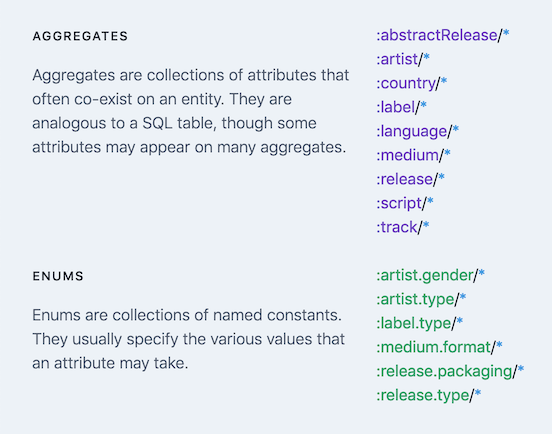
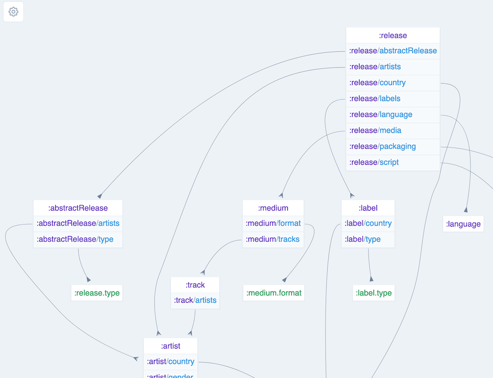
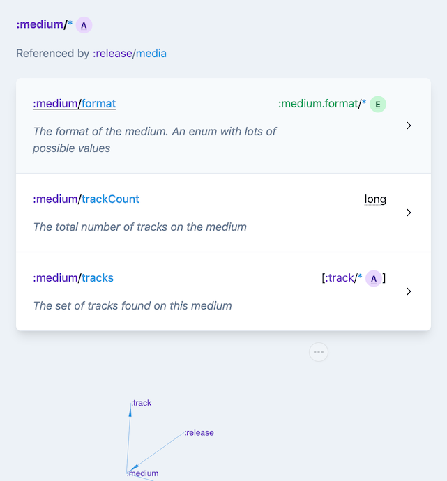
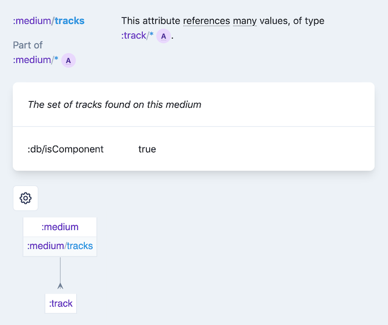

# Schema Voyager

Schema Voyager is a tool for exploring the schema of your [Datomic](https://www.datomic.com/) databases.
It aims to facilitate conversation about, spur design of and ease documentation of your schema.

After you [annotate](#annotate) your schema, Schema Voyager [ingests](#ingest) it, then provides several ways to [explore](#explore) and [export](#export) it.

Try exploring the [mbrainz schema](https://5e8a39a903b80b0006f2b2f1--focused-kepler-9497ed.netlify.com/) with Schema Voyager.

## Annotate

Datomic recommends that you [annotate schema](https://docs.datomic.com/cloud/best.html#annotate-schema) with information that Datomic doesn't need to run, but which helps explain the history and structure of the database.
Without any annotation, Schema Voyager will show the name, type, cardinality, uniqueness constraints and other properties of attributes included in any Datomic schema.
But with annotation, it can show much more—which attributes have been deprecated, how attributes are grouped and how attributes and tuples reference each other.

Though the annotation step is optional, it is an excellent way to enrich and document your schema.

To learn all the ways to annotate your schema, it is useful to understand some Schema Voyager [terminology](#terminology).

### Terminology

#### idents

While processing the `:db/ident`s in your schema, Schema Voyager classifies them into one of three types.

First, there are [**attributes**](https://docs.datomic.com/cloud/schema/defining-schema.html), the main part of any schema.
Their defining characteristic is that they have a [`:db/valueType`](https://docs.datomic.com/cloud/schema/schema-reference.html#db-valuetype).
An example is `:track/name`, which is a `:db.type/string`.

Second, there are [**constants**](https://docs.datomic.com/cloud/best.html#idents-for-enumerated-types), members of an enumerated type.
They are standalone entities, with a `:db/ident` but no `:db/valueType`.

Finally, there are [**entity specs**](https://docs.datomic.com/cloud/schema/schema-reference.html#entity-specs).
These are special entities that have a `:db/ident` as well as `:db.entity/attrs` or `:db.entity/preds`.
They are used to trigger entity-level validations within the transactor.

#### collections

Datomic attributes that share a namespace (e.g. `:track/artist` and `:track/duration`) often appear together on an entity.
In the majority of the database world, these namespaces would be called "tables".
The attributes would be called "columns" and the entities "rows".
However, Datomic itself does not use the word "table", nor does it introduce its own terminology for these collections of `:db/ident`s.

Schema Voyager calls collections of idents, unsurprisingly, **collections**.
There are two types.

An **aggregate** is a collection of attributes, what the SQL world would call a "table".

An **enum** is a collection of constants.

By default, `:artist` is the aggregate for the attribute `:artist/name` and `:medium.format` is the enum for the constant `:medium.format/dvd`.
However, read on about changing these defaults and handling more complex scenarios with [supplemental schema](#supplemental-schema).

### Supplemental Schema

With this terminology in hand, it is time to learn how to annotate your schema.

Schema Voyager introduces supplemental attribute properties for annotation.
You add these properties, most of which are in the `:db.schema` namespace, to attributes.
For example, to document that an attribute has been deprecated and replaced by another attribute:

```clojure
{:db/ident              :person/given-name
 :db.schema/deprecated? true
 :db.schema/see-others  [:person/full-name]
 :db/doc                "Was the person's first name, but since not every country follows the given/family name pattern, has been replaced by :person/full-name. See migration 5 which merged given+family into full name."}
```

It is up to you whether to transact this supplemental data, or leave it in an EDN or CLJ file.
From experience, this data stays more up-to-date if it is kept _out_ of Datomic.

For an example of supplemental schema, see [resources/mbrainz-supplemental.edn](resources/mbrainz-supplemental.edn).
That file augments the schema defined in [resources/mbrainz-schema.edn](resources/mbrainz-schema.edn) and [resources/mbrainz-enums.edn](resources/mbrainz-enums.edn).
It does not take advantage of every feature of the Schema Voyager supplemental schema, but is a good introduction.

#### :db.schema/part-of

Attributes and constants are part of one or more collections.
By default, Schema Voyager will derive that both `:artist/name` and `:artist/startYear` should be in the `:artist` aggregate and that `:artist.gender/female` should be in the `:artist.gender` enum.

However, the namespace of an attribute does not always match its usage.
Some attributes are used alongside attributes in a different namespace.
Others are used on many different aggregates.
So, if you need to, you can override the default collection:

```clojure
    ;; :timestamp/updated-at appears on both posts and comments
    {:db/ident          :timestamp/updated-at
     :db.schema/part-of [{:db.schema.collection/type :aggregate
                          :db.schema.collection/name :post}
                         {:db.schema.collection/type :aggregate
                          :db.schema.collection/name :comment}]}
```

#### :db.schema/deprecated?

When an attribute has fallen out of use, mark it as such:

```clojure
{:db/ident              :track/artistCredit
 :db.schema/deprecated? true}
```

#### :db.schema/see-also

It may help to understand an attribute by learning about one or more other attributes.


```clojure
    {:db/ident           :track/artistCredit
     :db.schema/see-also [:track/artist]}
```

NOTE: you can refer to collections without predefining them, but the same is not true of attribute references.
You may have to use tempids to create see-also references between attributes.


```clojure
    #:db{:id    "attr--track-artists"
         :ident :track/artists}
    #:db.schema{:db/ident    :track/artistCredit
                :see-also    ["attr--track-artists"]}
```

#### :db.schema/references

For attributes that are `{:db/valueType :db.type/ref}`, it is possible to annotate which collections the attribute references.
Adding references is one of the best ways to enrich your schema, and will enable many features when exploring your data.
To specify that `:address/country` refers to an entity with `:country/name` and `:country/alpha-3`, supplement your schema thus:

```clojure
    {:db/ident             :address/country
     :db.schema/references [{:db.schema.collection/type :aggregate
                             :db.schema.collection/name :country}]}
```

To indicate that `:address/region` might refer to either a U.S. state like `:region.usa/new-york` or Canadian province like `:region.can/quebec`.

```clojure
    {:db/ident             :address/region
     :db.schema/references [{:db.schema.collection/type :enum
                             :db.schema.collection/name :region.usa}
                            {:db.schema.collection/type :enum
                             :db.schema.collection/name :region.can}]}
```

#### :db.schema/tuple-references

[Heterogenous tuples](https://docs.datomic.com/cloud/schema/schema-reference.html#heterogeneous-tuples) may include `:db.type/ref`s.
To annotate the collections to which those refs refer, use `:db.schema/tuple-references`:

```clojure
    {:db/ident                   :post/ranked-comments
     :db/valueType               :db.type/tuple
     :db/tupleTypes              [:db.type/long :db.type/ref]
     :db/cardinality             :db.cardinality/many
     :db/doc                     "Pairs where the first element is a rank for a comment and the second element is a link to the comment itself. Used to sort the comments within a post."
     :db.schema/tuple-references [{:db.schema.tuple/position 1
                                   :db.schema/references     [{:db.schema.collection/type :aggregate
                                                               :db.schema.collection/name :comment}]}]}
```

**NOTE**: Use `:db.schema/references` to define the references of a [homogeneous tuple](https://docs.datomic.com/cloud/schema/schema-reference.html#homogeneous-tuples):

```clojure
    {:db/ident             :label/top-artists
     :db/valueType         :db.type/tuple
     :db/tupleType         :db.type/ref
     :db/cardinality       :db.cardinality/one
     :db/doc               "References to the top selling 0-5 artists signed to this label."
     :db.schema/references [{:db.schema.collection/type :aggregate
                             :db.schema.collection/name :artist}]}
```

#### :db.schema.tuple/position

The position at which a ref appears in a tuple.
Zero-indexed.
See `:db.schema/tuple-references` for an example.


#### :db.schema.collection/type and :db.schema.collection/name

By this point, you probably understand how to refer to a collection.
When used together, `:db.schema.collection/type` and `:db.schema.collection/name` define a collection.
Both are keywords.
`:db.schema.collection/type` can be either `:aggregate` or `:enum`.

An example is:

```clojure
    {:db.schema.collection/type :aggregate
     :db.schema.collection/name :artist}
```

**NOTE**: Since it is common to reference collections in supplemental schema, Schema Voyager provides an EDN reader, most commonly accessed via `schema-voyager.ingest.files/ingest`.
In an EDN file, the above could be re-written:

```clojure
    #schema-coll[:aggregate :artist]
```

You can also add `:db/doc` strings to collections:

```clojure
    {:db.schema.collection/type :aggregate
     :db.schema.collection/name :artist
     :db/doc                    "A person or group who contributed to a release or track."}
```

## Ingest

Schema Voyager can ingest schema from several sources.

* It can pull schema directly from a Datomic database.
* It can read schema from EDN files.
* It can accept Clojure data structures, as you would pass them to `d/transact`.
* And finally, it can combine these approaches to ingest from many sources simultaneously.

For example, you might pull your schema from Datomic, then supplement that data from a file which documents deprecated attributes.
When combining several sources Schema Voyager merges data, so later sources can augment or override earlier sources.

After collecting schema from all your sources, Schema Voyager manipulates the schema slightly and saves it into a DataScript DB.
This DB provides an expressive way to navigate the relationships between attributes.

We'll cover the [details](#load-schema) of ingesting and saving later.

## Explore

Now the fun part!
After ingesting schema data, the most common way to explore it is from a web app which Schema Voyager generates.
This app starts with an overview of all the aggregates, enums and entity specs in your schema.



There is a diagram of the references between collections.



Drill into an aggregate or enum to see the attributes or constants that it contains, as well as a more focused diagram of how it is connected to other collections.



Drill further into attributes or constants, to see their doc string, details about their data type, where they are used, how they connect collections, and much more metadata.



More adventerous users might enjoy exploring the DataScript DB directly in a Clojure REPL.
See the `comment` section of [`dev/ingest/projects/mbrainz.clj`](dev/ingest/projects/mbrainz.clj) for a sample.

## Export

If you want to share your schema data, you'll need to export it.

`schema-voyager.export/save-db` saves the full DataScript DB in EDN format to `resources/schema_voyager_db.edn`.
You may share or commit this file elsewhere.

From the DataScript file, you can [generate a standalone HTML file](#view-schema-html) from which to view the data.
This file is free of dependencies, so it can be committed, emailed or otherwise shared anywhere.

Within the HTML there are diagrams of collections and their relationships.
These can be exported as SVG files.
(Open the configuration menu in the upper left of any diagram.)

## Usage

OK, so how do you put it all together?

Schema Voyager is not (currently) designed to be used as a dependency in your code.
Instead, you should clone this repo and pull your schema into it.

You will do this in two steps.
First you will load your schema into a DataScript DB and save that DB into a file.
Then you will generate an HTML document from which to view that DataScript data.

### Load schema

After cloning the repo, create a Clojure file in Schema Voyager.
(You may want to name the file something like `dev/ingest/projects/my_project.clj`, because the `dev/ingest/projects/` directory is `.gitignore`'d.
Also, the `:ingest` alias adds the `dev/` directory to the classpath.)

This file will be a scratchpad for loading your schema.
(See [dev/ingest/projects/mbrainz.clj](dev/ingest/projects/mbrainz.clj) for an example of loading mbrainz schema.)

This file should follow these steps:

1. Ingest from all sources
    1. Use `schema-voyager.ingest.db/ingest` to ingest from a Datomic DB.
    1. Use `schema-voyager.ingest.files/ingest` to ingest from a file.
    1. Use static txn data.
1. Join multiple sources with `schema-voyager.data/join` or `schema-voyager.data/join-all`.
1. Process the joined data with `schema-voyager.data/process`.
1. Load the processed data into a DataScript DB with `schema-voyager.ingest.core/into-db`.
1. Save the DataScript DB to a location where the [exploration](#explore) tools can pick it up with `schema-voyager.export/save-db`.

```clojure
(ns ingest.projects.my-project
  (:require [schema-voyager.export :as export]
            [schema-voyager.data :as data]
            [schema-voyager.ingest.files :as ingest.files]
            [schema-voyager.ingest.core :as ingest]))

(defn -main []
  (->> ["../path/to/schema_a.edn"
        "../path/to/schema_b.edn"
        "../path/to/supplemental_schema.edn"]
       (map ingest.files/ingest)
       data/join-all
       data/process
       ingest/into-db
       export/save-db))
```

By giving the namespace a `-main` function, you will be able to reload the schema database from the terminal:

```sh
clj -A:ingest -m ingest.projects.my-project
```

If you intend to load data from a running Datomic database, use `schema-voyager.ingest.db/ingest`.

```clojure
(ns ingest.projects.my-project
  (:require [schema-voyager.export :as export]
            [schema-voyager.data :as data]
            [schema-voyager.ingest.db :as ingest.db]
            [schema-voyager.ingest.core :as ingest]))

(defn -main []
  (let [db (ingest.db/datomic-db {:server-type :ion
                                  :region      "us-east-1"
                                  :system      "my-system"
                                  :endpoint    "http://entry.my-system.us-east-1.datomic.net:8182/"
                                  :proxy-port  8182}
                                 "my-system-db")]
    (-> (ingest.db/ingest db)
        data/process
        ingest/into-db
        export/save-db)))
```

NOTE: If you require `schema-voyager.ingest.db`, you will need to have `datomic.client.api` on your classpath.
This project provides an alias `:datomic` which will pull in a version of `com.datomic/client-cloud`.

```sh
clj -A:ingest:datomic -m ingest.projects.my-project
```

If the provided version of `datomic.client.api` isn't right for your project, consider using `-Sdeps` to get the appropriate version.


Join data from several sources with `schema-voyager.data/join`:

```clojure
    (-> (data/join (ingest.db/ingest db)
                   supplemental-data)
        data/process
        ingest/into-db
        export/save-db)
```

### View schema HTML

After the DB file has been generated, you can view the schema from a standalone HTML file.

```sh
yarn --prod run standalone
```

Then open `target/standalone.html` in your browser.

If you wish to see updates as you change the DB file, you need a live version of the JS.
This is a bit more involved.
First you need HTML and CSS files.

```sh
yarn run html # only once, or if assets/index.html has changed
yarn run css # only once, or if anything in assets/css/* has changed
```

Then you need a running JS server.
You can start the server from from your terminal or editor.

From the terminal:

```sh
yarn run watch-js
```

From an Emacs ClojureScript REPL:

```emacs
M-x cider-jack-in-cljs
<choose shadow-cljs>
<choose shadow>
<choose :app>
```

After everything is loaded, open [http://localhost:8080](http://localhost:8080).

### Hosting HTML

The HTML, CSS and compiled JS can be hosted on Netlify or a server of your choice.
The compiled JS is completely static.
It contains a copy of the DataScript DB (via `shadow.resource/inline`), so it does not need to fetch that data from anywhere.

You have the option of hosting the standalone HTML file generated above, or an HTML file that references JS and CSS on the same server.
For the second option:

```sh
yarn --prod run clean
yarn --prod run html
yarn --prod run css # generates a purge-css-optimized version of the CSS
yarn --prod run compile-js # generates a Closure-optimized version of the JS
```

Whether using the single-file standalone HTML, or the multi-file option above, finally, upload `assets/*` to the server.

## Alternatives


* [Hodur](https://github.com/hodur-org/hodur-engine) provides excellent [visualizations](https://github.com/hodur-org/hodur-visualizer-schema) of Datomic schema, but also expects to have greater control over schema generation and management.


## Acknowlegements

* [DataScript](https://github.com/tonsky/datascript) makes it much easier to design and import deeply interconnected data without worrying about how those connections might later be explored.
  It is very useful to use export an entire database from Clojure, then read and manipulate it from ClojureScript.
  Also, it feels right to use Datalog to navigate Datomic data.
* Though the HTML app isn't very dynamic, it was nice, as always, to build it with [reagent](https://reagent-project.github.io/) and [reitit](https://metosin.github.io/reitit/).
* [Tailwind CSS](https://tailwindcss.com/) makes writing CSS _fun_.
  Along with assistance from [PostCSS](https://postcss.org/) and [PurgeCSS](https://purgecss.com/) it creates amazingly small CSS files.
  And the pages look nice, right?
* [shadow-cljs](http://shadow-cljs.org/) makes it a joy to write CLJS files alongside CLJ files.
  Several client/server interaction tasks I had been putting off turned out to be trivial with shadow-cljs.
